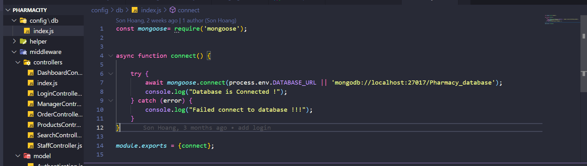

# Pharmacity management:

Hướng dẫn chạy dự án:

## tải mongodb, tạo database là Pharmacy_database, kết nối tới project bằng server url trong file `config/db/index.js`:



## Tải node_modules

Trong terminal gõ:

```shell
> npm install
```

## Chạy dự án

Trong terminal gõ:

```shell
> npm run dev
```

Dự án sẽ chạy trong [http://localhost:5000/](http://localhost:5000/)