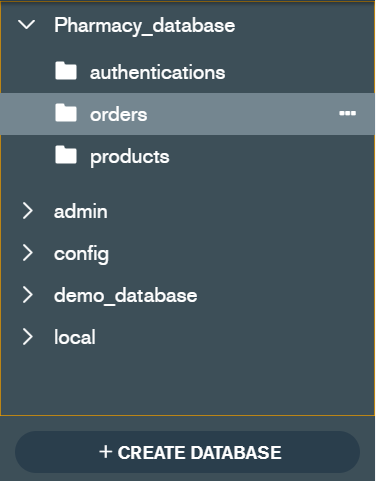
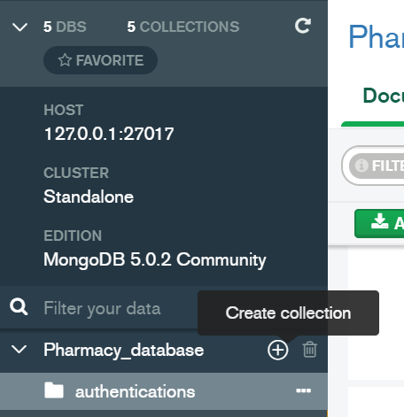
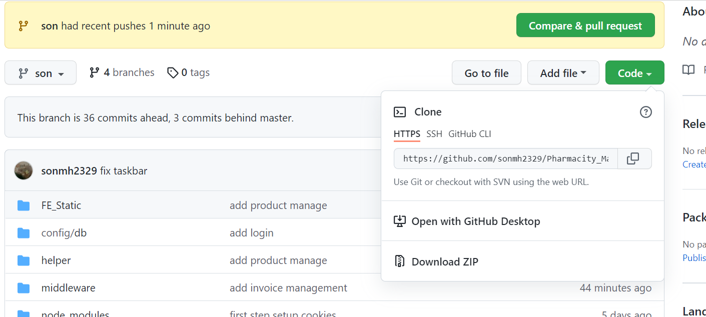

# Pharmacy_Management

## Cách sử dụng

Tải Mongo Compass rồi thực hiện theo các bước.

**Chú ý:** Cần download MongoDb Compass:
xem video này:

 [Hướng dẫn cài đặt Mongo Compass](https://fullstack.edu.vn/learning/nodejs?id=2311)

Sau khi cài đặt mongo compass. Xem hết video.

Vào Mongo Compass, nhấn **CREATE DATABASE** tạo database như sau:

**Lưu ý tạo tên giống hệt**
#
#
#

Tiếp theo ấn vào **Create collection** để tạo ra các collection _authentications, orders, products_(Lưu ý tạo tên cũng giống y hệt):

Trong các mục collection, nhấn **ADD DATA** > **Import file**

download các file **authentications.json** và **products.json** và Import vào các collection tương ứng. **order** collection sẽ do mình thực hiện thêm vào trên web quản lý

[Link tải file](https://drive.google.com/drive/u/0/folders/1pR4QHd9wVxZibU1pIXWuIT1dEgLfSKKH)

Sau khi chọn file xong ấn **import** > **DONE**

## Chạy project

B1: vào branch son > Code > Download zip

B2: Mở code ra. Mở terminal gõ: npm run dev.